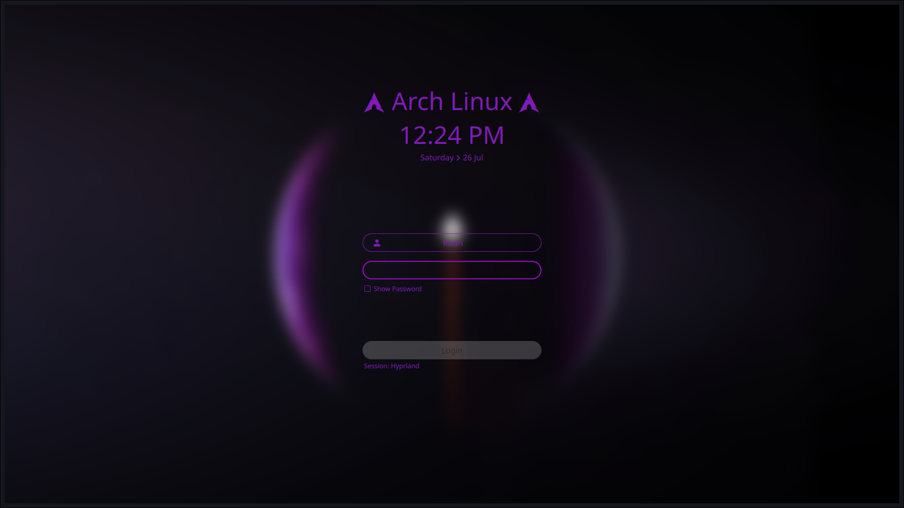

# Lunar Purple SDDM

Lunar Purple Theme for SDDM



## Dependencies

[`sddm >= 0.18.0`](https://github.com/sddm/sddm), [`qt5 >= 5.11.0`](http://doc.qt.io/qt-5/index.html), [`qt5-quickcontrols2 >= 5.11.0`](http://doc.qt.io/qt-5/qtquickcontrols2-index.html), [`qt5-svg >= 5.11.0`](https://doc.qt.io/qt-5/qtsvg-index.html)

*Make sure these are up to date!*


## Add the Theme

- Open terminal, and clone the repository with:

```bash
sudo git clone https://github.com/rodrig20/lunar-purple-sddm.git  /usr/share/sddm/themes/lunar-purple-sddm
```

## Configure

Edit the `/etc/sddm.conf` (with any text editor with **raised** privileges), so that it looks like this:

```bash
# /etc/sddm.conf
...
[Theme]
Current=lunar-purple-sddm
```

## Credits

- Source from [`Sugar Dark for SDDM`](https://github.com/MarianArlt/sddm-sugar-dark)

## License

[GNU Lesser General Public License v3.0](LICENSE)
